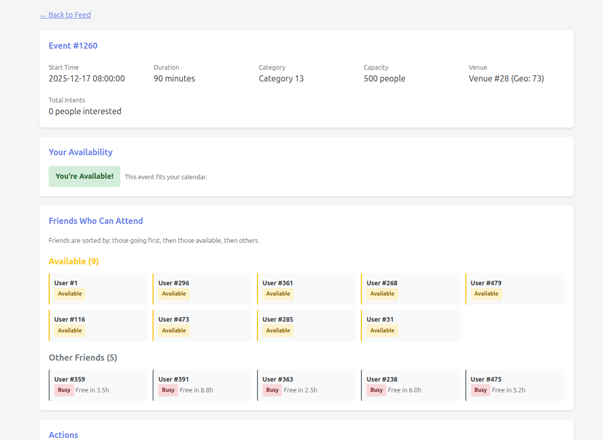

# Calendar-Aware Social Event Feed Recommender

A local, reproducible sandbox for prototyping a calendar-aware social event feed recommender using a temporal heterogeneous Graph Neural Network (GNN). This project demonstrates an end-to-end ML recommendation system with a web UI for inspection.

<p align="center">
  
  
</p>

## Features

- **Synthetic Data Generation**: Creates realistic users, friendships (with communities), events, venues, calendars, and user actions
- **Two-Tower Retrieval Model**: User and event embeddings trained with BPR loss for candidate generation
- **Temporal Heterogeneous GNN**: Refines embeddings using social connections and interaction edges with temporal features
- **Calendar Availability**: Matches user free time with event slots, including travel buffers
- **Social Proof Signals**: Friend intents and feasibility boost event rankings
- **Flask Web UI**: Browse personalized feeds, see ranking explanations, and friend availability

## Architecture

```
┌─────────────────────────────────────────────────────────────────┐
│                         User Request                             │
└─────────────────────────────────┬───────────────────────────────┘
                                  │
                                  ▼
┌─────────────────────────────────────────────────────────────────┐
│                    Candidate Generation                          │
│  ┌─────────────┐    ┌─────────────┐    ┌─────────────────────┐  │
│  │ User Tower  │    │ Event Tower │    │ Two-Tower Similarity │ │
│  └─────────────┘    └─────────────┘    └─────────────────────┘  │
└─────────────────────────────────┬───────────────────────────────┘
                                  │
                                  ▼
┌─────────────────────────────────────────────────────────────────┐
│                    Feature Engineering                           │
│  • Availability Fit    • Friend Intent Count                     │
│  • Distance (km)       • Friend Feasible Count                   │
│  • Category Match      • Freshness                               │
└─────────────────────────────────┬───────────────────────────────┘
                                  │
                                  ▼
┌─────────────────────────────────────────────────────────────────┐
│                    Temporal Hetero GNN                           │
│  Node types: user, event, venue                                  │
│  Edge types: friend, view, like, save, intent, attend, hosted_at │
│  → Refined user/event embeddings                                 │
└─────────────────────────────────┬───────────────────────────────┘
                                  │
                                  ▼
┌─────────────────────────────────────────────────────────────────┐
│                    Fusion Reranker (MLP)                         │
│  Inputs: TT similarity + GNN embeddings + Engineered features    │
│  Output: Final ranking score                                     │
└─────────────────────────────────┬───────────────────────────────┘
                                  │
                                  ▼
┌─────────────────────────────────────────────────────────────────┐
│                    Ranked Event Feed                             │
└─────────────────────────────────────────────────────────────────┘
```

## Quick Start

### Prerequisites

- Ubuntu 24.04 (or compatible Linux)
- Python 3.11+
- NVIDIA GPU with CUDA support (tested on RTX 4070 Super)
- Docker (optional, for containerized runs)

### Option 1: Local Installation

```bash
# Clone the repository
git clone https://github.com/yourusername/Social_Algo.git
cd Social_Algo

# Install dependencies
make setup

# Run the full demo (small mode for quick testing)
make demo
```

### Option 2: Docker

```bash
# Build and run demo in Docker
make docker_demo
```

### Option 3: Step-by-Step

```bash
# 1. Generate synthetic data
make gen_data

# 2. Derive availability features
make derive

# 3. Build candidate features
make build_candidates

# 4. Train two-tower model
make train_baseline

# 5. Train GNN model
make train_gnn

# 6. Start web server
make serve
```

## Web UI

Once the server is running, open http://localhost:8000 in your browser.

### What to explore:

1. **Home Page**: Select a user from the list to see their personalized feed
2. **Feed Page**:
   - Events ranked by final score
   - Green border = user is available
   - See "Why This Event?" breakdown for each recommendation
   - Friend intent and feasibility badges
3. **Event Detail Page**:
   - Check your availability and next feasible slot
   - See which friends are going or can attend
   - Friends sorted by: going > available > interested but busy > others

## Project Structure

```
Social_Algo/
├── docker/
│   ├── Dockerfile           # CUDA-enabled container
│   └── docker-compose.yml   # Service definitions
├── src/
│   ├── config.py            # Pydantic configuration
│   ├── data/
│   │   ├── gen_synth.py         # Synthetic data generation
│   │   ├── derive_availability.py # Calendar processing
│   │   └── build_candidates.py   # Feature engineering
│   ├── models/
│   │   ├── two_tower.py     # Two-tower retrieval model
│   │   ├── reranker.py      # MLP reranker
│   │   └── gnn.py           # Temporal heterogeneous GNN
│   ├── train/
│   │   ├── train_two_tower.py  # Two-tower training
│   │   └── train_gnn.py        # GNN + reranker training
│   └── serve/
│       ├── app.py           # Flask application
│       └── templates/       # HTML templates
├── tests/
│   └── test_smoke.py        # Smoke tests
├── data/                    # Generated data (gitignored)
├── models/                  # Model checkpoints (gitignored)
├── runs/                    # Training metrics (gitignored)
├── notebooks/               # Exploration notebooks
├── Makefile                 # Build automation
├── requirements.txt         # Python dependencies
└── README.md
```

## Configuration

All configuration is managed through Pydantic models in `src/config.py`.

### Small Mode (Quick Testing)
- 500 users, 3,000 events, 50 venues
- Faster training (5 epochs)
- Use with `--small` flag or `SMALL=1 make ...`

### Full Mode (Default)
- 5,000 users, 30,000 events, 300 venues
- Full training (20-30 epochs)

## Data Model

### Entities

| Entity | Fields |
|--------|--------|
| Users | user_id, age_bucket, home_geo_cell, interest_vector, schedule_type |
| Friendships | user_id_1, user_id_2 (undirected) |
| Venues | venue_id, geo_cell, categories, popularity |
| Events | event_id, venue_id, start_time, duration_min, category, capacity |
| Calendars | user_id, block_start, block_end |
| Impressions | user_id, event_id, ts_shown |
| Actions | user_id, event_id, action_type (view/like/save/intent/attend), ts |

### Action Funnel

Actions are generated probabilistically based on:
- Interest match (user interests vs. event category)
- Distance penalty (geo_cell proximity)
- Availability boost (3x when user is free)
- Social proof boost (2x per friend with intent)

## Training Pipeline

### Time Split

To prevent data leakage:
- **Train**: Days 1-10
- **Validation**: Days 11-12
- **Test**: Days 13-14

Only edges/actions up to the cutoff are included in each split.

### Two-Tower Model

- BPR loss with negative sampling
- User tower: ID embedding + geo + age + schedule + interests
- Event tower: ID embedding + venue + category + time features

### GNN Model

- HGTConv (Heterogeneous Graph Transformer)
- 2 layers, 4 attention heads, 64 hidden dim
- Node types: user, event, venue
- Edge types: friend, view, like, save, intent, attend, hosted_at

### Fusion Reranker

- Input: TT similarity + engineered features + GNN embeddings
- Architecture: MLP with BatchNorm and Dropout
- Output: Final ranking score

## API Endpoints

| Endpoint | Description |
|----------|-------------|
| `GET /` | User selection page |
| `GET /feed/<user_id>` | Personalized feed for user |
| `GET /event/<event_id>?user_id=X` | Event details with availability |
| `GET /api/feed/<user_id>` | JSON feed data |
| `GET /api/event/<event_id>?user_id=X` | JSON event details |

## Commands Reference

```bash
# Setup
make setup              # Install all dependencies

# Data Pipeline
make gen_data           # Generate synthetic data
make derive             # Derive availability features
make build_candidates   # Build candidate features

# Training
make train_baseline     # Train two-tower model
make train_gnn          # Train GNN + reranker

# Serving
make serve              # Start web server on port 8000

# Full Pipelines
make demo               # Run everything (small mode)
make demo_full          # Run everything (full mode)

# Testing
make test               # Run all tests
make smoke_test         # Run smoke tests only

# Docker
make docker_build       # Build Docker image
make docker_demo        # Run demo in Docker
make docker_serve       # Run server in Docker

# Utilities
make clean              # Remove generated files
make format             # Format code with black
make typecheck          # Run mypy type checker
```

## Testing

```bash
# Run all tests
make test

# Run smoke tests only
make smoke_test

# Run tests with coverage
python -m pytest tests/ -v --cov=src
```

## Performance Notes

- Training completes in ~10 minutes on RTX 4070 Super (small mode)
- Full mode takes ~30-60 minutes depending on data size
- Server loads data into memory on startup (~500MB for small mode)
- Feed generation is optimized but may take 1-2 seconds for large event sets

## Engineering Standards

- **Reproducibility**: All random seeds are fixed
- **Type Safety**: Pydantic configs with validation
- **Logging**: Loguru for structured logging
- **Metrics**: Training metrics saved to `runs/` as JSON
- **Tests**: Smoke tests for all major components
- **No External APIs**: Everything runs locally with synthetic data

## Troubleshooting

### CUDA Issues
```bash
# Check CUDA availability
python -c "import torch; print(torch.cuda.is_available())"

# If CUDA not found, reinstall PyTorch
pip install torch --index-url https://download.pytorch.org/whl/cu121
```

### Memory Issues
```bash
# Use small mode
SMALL=1 make demo

# Or reduce batch sizes in src/config.py
```

### Docker GPU Access
```bash
# Ensure nvidia-container-toolkit is installed
sudo apt-get install -y nvidia-container-toolkit
sudo systemctl restart docker
```

## License

MIT License - see LICENSE file for details.

## Acknowledgments

- PyTorch Geometric for heterogeneous graph support
- Flask for simple web serving
- Polars for fast data processing
